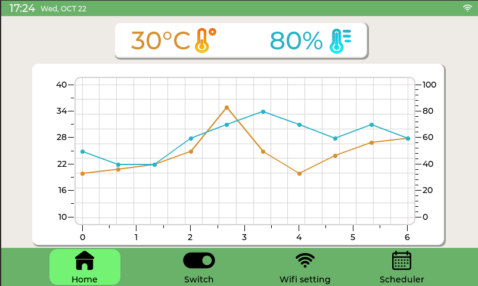
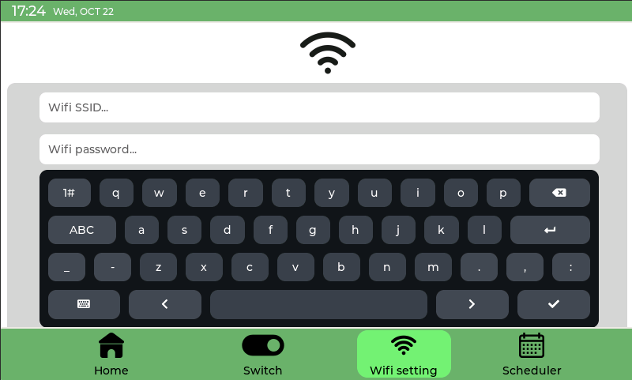
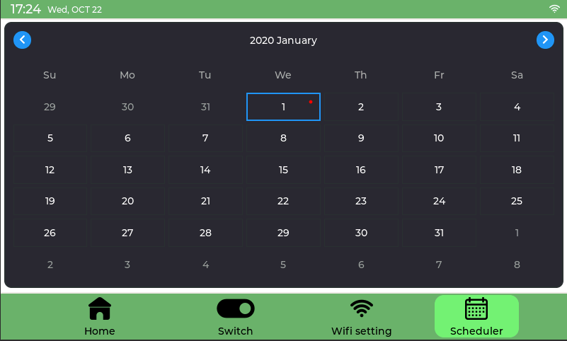

# Smart Agriculture HMI Controller (ESP32-S3 + LVGL)

> **An industrial-grade, user-centric embedded interface for precision farming, powered by the ESP32-S3 and LVGL graphics library.**

---

## 📖 Overview

This project implements a sophisticated **Graphical User Interface (GUI)** designed to bridge the gap between advanced IoT automation and non-technical agricultural operators. Utilizing the **ESP32-S3** and the **LVGL** library, we have developed a 7-inch interactive dashboard that replaces traditional, rigid hardware controllers with a modern, intuitive experience.

**Key Objectives:**
* Transition from segmented LCDs to full-color interactive dashboards.
* Deliver premium "Industry 4.0" features on cost-effective embedded hardware.
* Minimize the technical learning curve for farmers through user-centric design.

---

## ✨ Key Achievements

### 🎨 Design Success
* **Highly Responsive UI:** Created a touch-friendly interface optimized for 7-inch displays.
* **Complex Widget Implementation:** Successfully integrated real-time charts for trend monitoring and calendar widgets for scheduling.
* **Cognitive Load Reduction:** Applied a uniform color scheme (Green/White) and consistent font sizes to simplify information processing for the operator.

### ⚙️ Technical Success
* **System Integration:** Achieved stable integration of the ESP32-S3 SoC, FreeRTOS, and the LVGL framework.
* **Advanced Behavioral Scheduler:** Implemented a robust "Routine Engine" that supports complex, reusable scheduling logic.
* **Cloud Connectivity:** Real-time data synchronization and remote control via MQTT protocol.

---

## 🏗️ Technical Architecture

The software follows a multi-tasking architecture managed by **FreeRTOS** to ensure that graphical rendering does not interfere with critical control logic.

* **GUI Framework:** LVGL (Light and Versatile Graphics Library).
* **Operating System:** FreeRTOS for real-time task management.
* **Communication:** MQTT for low-latency IoT interaction.

---

## 🖼️ UI Showcase

[cite_start]Our HMI features a high-fidelity interface with a consistent design language across multiple functional modules, ensuring a seamless user experience[cite: 701, 704].

| **Home Screen** | **Manual Switch Control** |
| :---: | :---: |
|  | .png) |
| [cite_start]*Real-time environment monitoring with live trend charts[cite: 443, 473].* | [cite_start]*Direct toggle switches for pumps, fans, and lighting systems[cite: 477, 501].* |

| **Wi-Fi Configuration** | **Advanced Scheduler** |
| :---: | :---: |
|  |  |
| [cite_start]*Full QWERTY virtual keyboard for on-device network setup[cite: 504, 547].* | [cite_start]*Complex routine management with a visual calendar interface[cite: 552, 617, 697].* |

---
## 📊 Resource Evaluation & Efficiency

The system has been rigorously evaluated for stability and resource utilization:

| Memory Type | Usage [bytes] | Usage [%] | Technical Verdict |
| :--- | :--- | :--- | :--- |
| **IRAM** | 16,383 | **99.99%** | Maximized for zero-wait state instruction execution. |
| **DIRAM** | 140,687 | **41.17%** | Significant overhead remaining (**201 KB**) for future logic. |
| **Flash Code** | 994,998 | - | Optimized binary footprint for the ESP32-S3 platform. |
| **Flash Data** | 607,824 | - | Efficient management of high-fidelity UI assets (fonts, icons). |

**Total Binary Size:** ~1.7 MB (occupying only ~10% of a 16MB Flash module).

---

## ⚠️ Limitations & Roadmap

### **Current Limitations**
* **Edge-Case Exceptions:** Some specific software exceptions under rare conditions are still being refined for perfect robustness.
* **Power Management:** Currently lacks integration with ESP32-S3 Light/Deep Sleep modes for display power saving.
* **Static Configuration:** Peripheral hardware mapping is hardcoded and cannot yet be reconfigured via the UI.

### **Future Improvements**
* **Enhanced Robustness:** Implementation of comprehensive error-trapping and Watchdog Timers (WDT).
* **Low-Power Logic:** Auto-dimming or screen timeout features to preserve hardware longevity.
* **Dynamic Mapping:** A dedicated "Settings" menu to allow users to customize sensor and controller pins on-the-fly.
* **Edge Analytics:** Utilizing the remaining **201 KB of DIRAM** for local data logging and offline trend analysis.

---

## 👥 Team & Acknowledgments

**Students (Computer Engineering - Council 1CC):**
* **TRAN MANH TAI** (2152950)
* **HUYNH DAO DONG QUAN** (2053367)
* **TRAN TRUONG GIANG** (2152534)

**Thesis Committee:**
* **Assoc. Prof., Dr. Tran Ngoc Thinh**
* **Dr. Le Trong Nhan** (Supervisor)
* **Assoc. Prof., Dr. Pham Hoang Anh**
* **B.Sc. Phan Van Sy** (Reviewer)

---
*Ho Chi Minh City, December 2025*